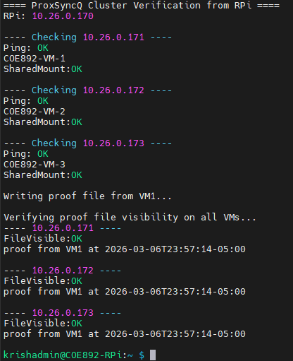
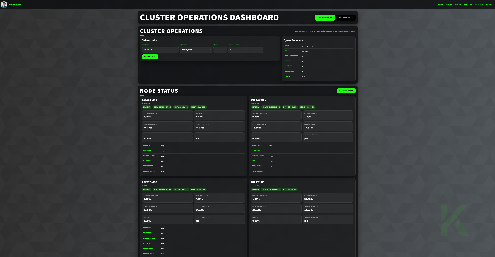
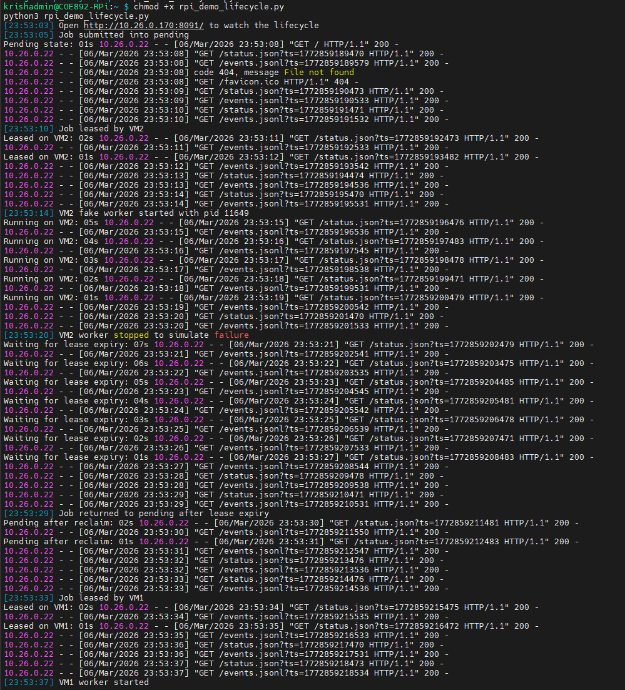

# ProxSyncQ

ProxSyncQ is a lightweight fault-aware execution platform for a small Proxmox-based cluster. It combines shared storage, worker daemons, lease-based reclaim, and a Raspberry Pi-hosted operations dashboard to make distributed job execution easier to observe, repeat, and recover.

## Current deployment

The current lab deployment runs on **4 active nodes**:

- **Raspberry Pi coordinator:** `10.26.0.170`
- **Worker VM 1:** `10.26.0.171`
- **Worker VM 2:** `10.26.0.172`
- **Worker VM 3:** `10.26.0.173`

Shared storage is mounted on the worker VMs at:

    /srv/proxsyncq/shared

The Raspberry Pi hosts the operations dashboard and the lifecycle demo view.

## What is working now

- stable static addressing across the cluster
- worker daemons running on the VMs
- shared storage visibility across worker nodes
- durable file-based queue state
- live queue lifecycle demo from the Raspberry Pi
- reclaim after simulated worker failure
- operations dashboard with:
  - queue summary
  - per-node health cards
  - Gluster failover ring view
  - recent jobs table

## Current queue model

Jobs currently move through **five visible states**:

- `pending`
- `leased`
- `running`
- `completed`
- `failed`

Each job is represented as a durable record with:
- job ID
- type
- payload
- attempt count
- timestamps
- lease ownership data
- log and artifact references

## Current design

ProxSyncQ currently has four main parts:

1. **Shared storage**  
   Durable location for queue records, logs, and artifacts.

2. **Worker daemons on the VMs**  
   Poll for jobs, claim work, execute handlers, and update queue state.

3. **Raspberry Pi-hosted operations dashboard**  
   Central view for node health, queue state, and recent activity.

4. **Durable file-based queue state model**  
   Makes state transitions visible and easy to inspect.

There is currently **no permanent master worker**. Coordination happens through shared storage and visible queue files.

## Observed reclaim demo

A recorded lifecycle run already demonstrates reclaim across workers:

- **23:53:05** job submitted into `pending`
- **23:53:10** job leased by **VM2**
- **23:53:14** job started on **VM2**
- **23:53:20** VM2 worker stopped to simulate failure
- **23:53:29** job returned to `pending` after lease expiry
- **23:53:33** job leased by **VM1**
- **23:53:37** job started on **VM1**
- **23:53:45** job completed on **VM1**

This gives an observed prototype reclaim path of about:

- **9 seconds** from failure to requeue
- **13 seconds** from failure to reclaim

These are current demo timings, not final enforced policy values.

## Screenshots

### Cluster summary and node IP view

### Operations dashboard

### Raspberry Pi lifecycle demo

## Current status

This repository is already beyond the planning stage and reflects a working prototype. The following are operational now:

- shared storage-backed queue state
- worker-level reclaim after interruption
- Raspberry Pi-hosted dashboard
- Raspberry Pi-hosted live lifecycle demo
- cluster health visibility from a single control point

The following are **not yet active** in the current queue path:

- Proxmox VE API recovery
- dedicated web API for queue control

RabbitMQ and PostgreSQL may appear in health checks on the dashboard, but they should currently be treated as **monitored infrastructure components**, not required dependencies of the active reclaim demo path.

## Repository guide

### Architecture
- `docs/architecture.md`
- `diagrams/architecture.drawio`

### Quickstart
- `docs/quickstart.md`

### Demo
- `docs/demo.md`
- `docs/failure-tests.md`

### Evaluation
- `docs/evaluation.md`

### Networking
- `docs/networking.md`

## Project goals

The main goals of ProxSyncQ are:

- submit a job once and allow any healthy worker to execute it
- keep job state durable and visible on shared storage
- reclaim unfinished work after worker failure
- provide strong observability through the Raspberry Pi dashboard
- keep the system simple enough to inspect and defend during demonstration

## Roadmap

Next steps include:

- formalizing the queue directory layout
- finalizing the job schema
- improving event history and queue tracing
- hardening reclaim behavior under repeated tests
- integrating safe VM-level recovery through the Proxmox VE API

## Summary

ProxSyncQ turns a small Proxmox-based lab cluster into a more structured and fault-aware execution platform. Instead of relying on manual node selection and ad hoc recovery, it uses shared storage, worker daemons, and centralized Raspberry Pi visibility to provide durable job execution, visible reclaim behavior, and repeatable demonstrations.
